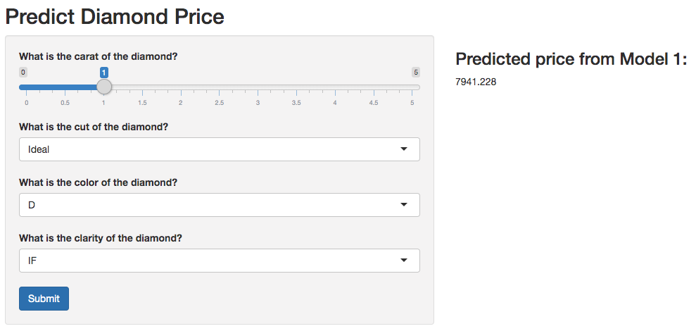

```{r setup, include=FALSE}
knitr::opts_chunk$set(echo = FALSE)
``` 

## Introduction
This is a presentation for the final course project of Developing Data Products course. In this project, I crated a Shiny app to predict diamond price based on its "4C" parameters, namely Carat, Cut, Color and Clarity. The Shiny app link is https://jh668.shinyapps.io/diamond-price-prediction/

```{r, echo=FALSE}
   
```


## Diamond Data
The diamond price prediction app is built based on the dataset "diamonds" in the ggplot2 R package. Price prediction model is built on the "4C" variables: 

- **Carat:** 1 carat = 200 mg
- **Cut:** 5 levels (Ideal, Premium, Very Good, Good, Fair)
- **Color:** 7 levels (D, E, F, G, H, I, J)
- **Clarity:** 8 levels (IF, VVS1, VVS2, VS1, VS2, SI1, SI2, I1)


## Price Prediction Model
A linear regression model is built on price against the "4C" variables. The model summary is shown below.

```{r diamonds, echo = FALSE}
library(ggplot2)
model1 <- lm(price ~ carat+cut+color+clarity, data=diamonds)
model1
```

## Price Prediction Shiny App
The price prediction shiny app uses the input of the "4C" parameters and predict the diamond price based on the training model shown above. 

```{r, echo=FALSE}
   
```